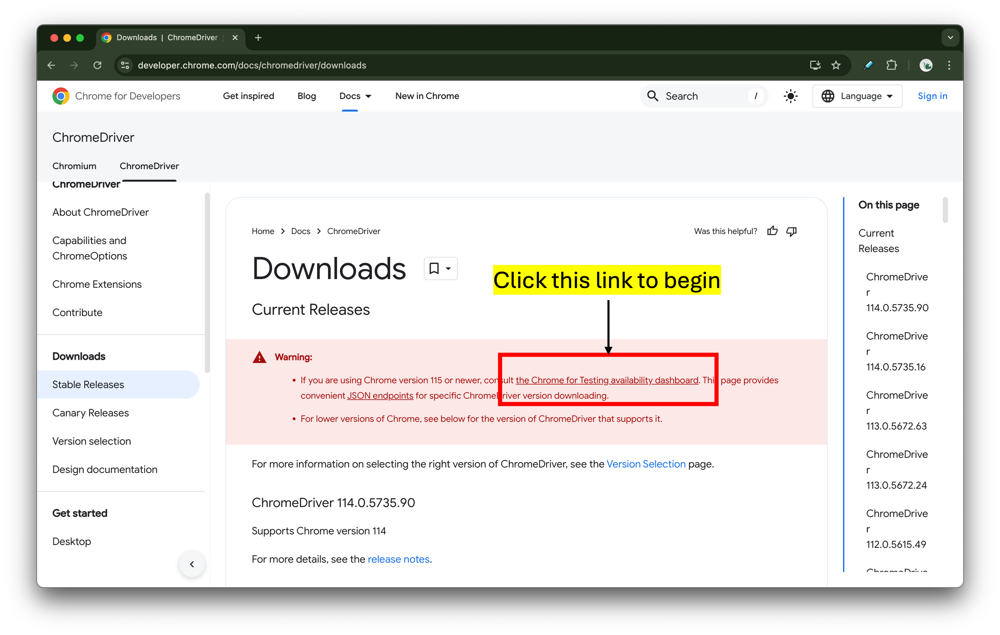
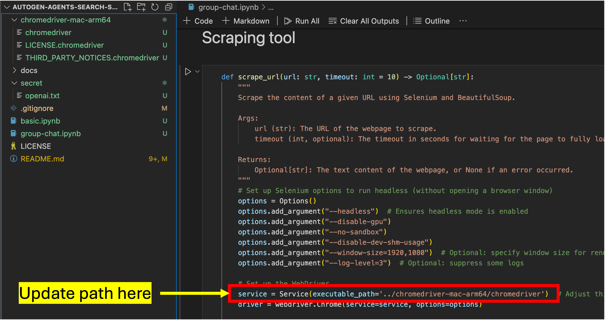

# autogen-agents-search-summarize
Agents to help you search and summarize from web searches, empowered by Autogen library

> ℹ️ This repo contains demos that we used in our video 🎬 ["Autogen, Building Multi-Agent agentic app, Beginner-to-Master"](https://youtube.com/live/fXR2U5PlxoA)

This repo will teach you how to:
- Understand basic concepts of [Autogen library](https://www.microsoft.com/en-us/research/project/autogen/), a framework that enables agentic workflow and multi-agent collaboration
- Build simple two-agent conversations that uses a search engine (specifically DuckDuckGO)
- Build a 'group-chat' agents to illustrate multi-agent collaboration. This group of agents will help research and summarize via web search and LLM.

## Tools you will use
- [Autogen](https://github.com/microsoft/autogen)
- [duckduckgo_search](https://github.com/deedy5/duckduckgo_search)
- OpenAI API

## Required configuration
Assuming you want to quickly use this repo, please follow the steps below.

### 1. Install environment
You can install libraries using the provided `requirements.txt`

```
pip install -r equirements.txt
```

### 2. OpenAI API key
You can save your OpenAI API key in this file: secret/openai.txt
> Do not share your OpenAI API Key

### 3. WebDrive
2.1 Download the correct version of [Chrome WebDriver](https://developer.chrome.com/docs/chromedriver/downloads) for your machine. Unzip, if necessary.



2.2 Update the path to Chrome WebDrive




## Sharing & Crediting

> Feel free to copy and distribute, but we appreciate you giving us credits.


## ⛓️Connect with Us:

👍 Like | 🔗 Share | 📢 Subscribe | 💬 Comments | ❓ Questions

[LinkedIn](www.linkedin.com/company/casedonebyai) <br>
[YouTube](www.youtube.com/@CaseDonebyAI) <br>
[Facebook](www.facebook.com/casedonebyai) <br>
[TikTok](www.tiktok.com/@casedonebyai) <br>
[Github](www.github.com/casedone) <br>
[SubStack](casedonebyai.substack.com)
